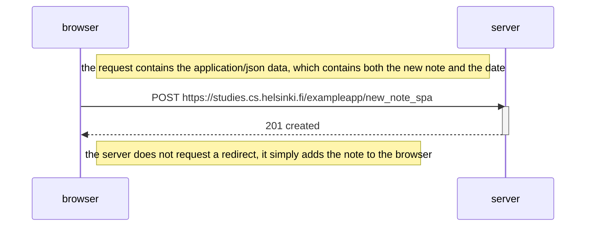

```mermaid
    sequenceDiagram
        participant browser
        participant server

        Note right of browser: the request contains the application/json data, which contains both the new note and the date
        browser->>server: POST https://studies.cs.helsinki.fi/exampleapp/new_note_spa
        activate server
        server-->>browser: 201 created;
        deactivate server

        Note right of browser: the server does not request a redirect, it simply adds the note to the browser
```